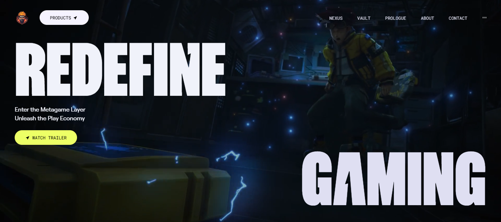
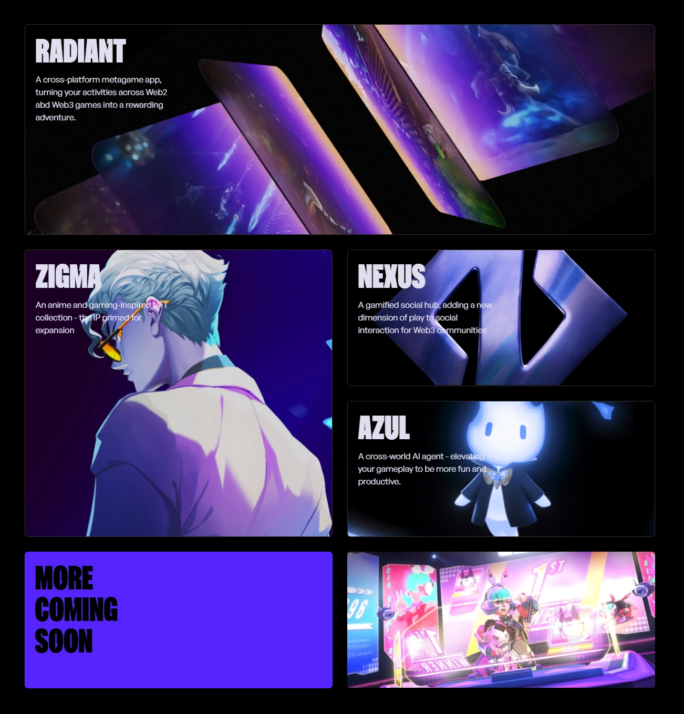

[](https://choosealicense.com/licenses/mit/)

# Pixel Flow

Captivating, animation-filled landing page inspired by zentry.com
## Table of Content

- [Tech Stack](#tech-stack)
- [Screenshots](#screenshots)
- [Installation](#installation)
- [Usage](#usage)
- [License](#license)
- [Acknowledgements](#acknowledgements)
  
## Tech Stack

- **Framework:** React

- **Styles:** TailwindCSS

- **Animation:** GSAP
## Screenshots




## Installation

1. Clone the repository

```bash
git clone https://github.com/peterxavier01/PixelFlow-React-GSAP-Landing-Page
```
2. Install the necessary dependencies
```bash
npm install
```
## Usage

After installation, start the developemnt server

```bash
npm run dev
```
Open your browser and go to http://localhost:5173 to start using PixelFlow
## License

This project is licensed under the MIT License - see the [LICENSE](https://choosealicense.com/licenses/mit/) file for details.


## Acknowledgements

 - [Zentry](https://zentry.com)


## 🔗 Links
[](https://peteruadiale.com/)
[](https://www.linkedin.com/in/peter-o-uadiale-69541a19a/)
